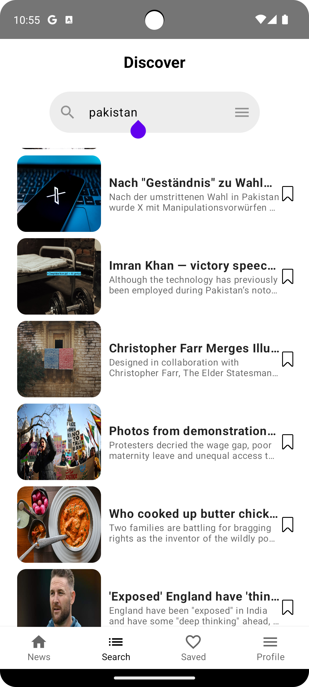
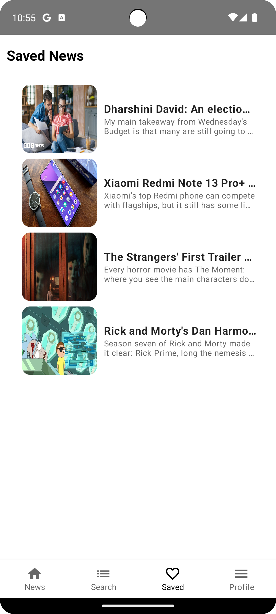

# 💎 Compose Multiplatform - News App

# Application Scope
This is a simple application that presents news information. The data is dynamically sourced from the [News Api](https://newsapi.org/).

🗡️ This demonstrates modern Android development with Hilt, Coroutines, Flow, Jetpack (Room, ViewModel), and Material Design based on MVVM architecture.

The app has a few screens located in multiple feature modules:

- News list screen - displays list of News
- News detail screen - display information about the selected news item
- Favourites screen - display list of news item which are stored in local app database
- Profile screen - empty (WiP)
    
- 

  
  
  
  

## Tech-Stack
This project takes advantage of best practices and many popular libraries and tools in the Android ecosystem. Most of
the libraries are in the stable version unless there is a good reason to use non-stable dependency.

* Tech-stack
    * [100% Kotlin](https://kotlinlang.org/)
        + [Coroutines](https://kotlinlang.org/docs/reference/coroutines-overview.html) - perform background operations
        + [Kotlin Flow](https://kotlinlang.org/docs/flow.html) - data flow across all app layers, including views
        + [Kotlin Symbol Processing](https://kotlinlang.org/docs/ksp-overview.html) - enable compiler plugins
        + [Kotlin Serialization](https://kotlinlang.org/docs/serialization.html) - parse [JSON](https://www.json.org/json-en.html)
    * [Ktor](https://ktor.io/) - networking
    * [Jetpack](https://developer.android.com/jetpack)
        * [Compose](https://developer.android.com/jetpack/compose) - modern, native UI kit
        * [Lifecycle](https://developer.android.com/topic/libraries/architecture/lifecycle) - perform an action when
          lifecycle state changes
        * [ViewModel](https://developer.android.com/topic/libraries/architecture/viewmodel) - store and manage UI-related
          data in a lifecycle-aware way
        * [Sqldelight](https://github.com/cashapp/sqldelight) - store offline cache
    * [Koin](https://insert-koin.io/) - dependency injection (dependency retrieval)
* Modern Architecture
    * [Clean Architecture](https://blog.cleancoder.com/uncle-bob/2012/08/13/the-clean-architecture.html)
    * Single activity architecture
    * MVVM + MVI (presentation layer)
    * [Android Architecture components](https://developer.android.com/topic/libraries/architecture)
      ([ViewModel](https://developer.android.com/topic/libraries/architecture/viewmodel)
      , [Kotlin Flow](https://kotlinlang.org/docs/flow.html)
    * [Android KTX](https://developer.android.com/kotlin/ktx) - Jetpack Kotlin extensions
* UI
    * Reactive UI
    * [Jetpack Compose](https://developer.android.com/jetpack/compose) - modern, native UI kit (used for Fragments)
    * [Material Design 3](https://m3.material.io/) - application design system providing UI components

## Architecture
**KMP-News-App** is based on the MVVM architecture and the Repository pattern, which follows the [Google's official architecture guidance](https://developer.android.com/topic/architecture).

The overall architecture of **KMP-News-App** is composed of two layers; the UI layer and the data layer. Each layer has dedicated components and they have each different responsibilities, as defined below:

**Pokedex** was built with [Guide to app architecture](https://developer.android.com/topic/architecture), so it would be a great sample to show how the architecture works in real-world projects.

### Architecture Overview

- Each layer follows [unidirectional event/data flow](https://developer.android.com/topic/architecture/ui-layer#udf); the UI layer emits user events to the data layer, and the data layer exposes data as a stream to other layers.
- The data layer is designed to work independently from other layers and must be pure, which means it doesn't have any dependencies on the other layers.

With this loosely coupled architecture, you can increase the reusability of components and scalability of your app.

### UI Layer

The UI layer consists of UI elements to configure screens that could interact with users and [ViewModel](https://developer.android.com/topic/libraries/architecture/viewmodel) that holds app states and restores data when configuration changes.
- UI elements observe the data flow via [DataBinding](https://developer.android.com/topic/libraries/data-binding), which is the most essential part of the MVVM architecture.
- With [Bindables](https://github.com/skydoves/bindables), which is an Android DataBinding kit for notifying data changes, you can implement two-way binding, and data observation in XML very clean.

### Data Layer

The data Layer consists of repositories, which include business logic, such as querying data from the local database and requesting remote data from the network. It is implemented as an offline-first source of business logic and follows the [single source of truth](https://en.wikipedia.org/wiki/Single_source_of_truth) principle. 

**KMP-News-App** is an offline-first app is an app that is able to perform all, or a critical subset of its core functionality without access to the internet.
So users don't need to be up-to-date on the network resources every time and it will decrease users' data consumption. For further information, you can check out [Build an offline-first app](https://developer.android.com/topic/architecture/data-layer/offline-first).

## Find this repository useful ? :heart:

Support it by giving a ⭐ to this repository.

## Author - Momin Tahir

  

